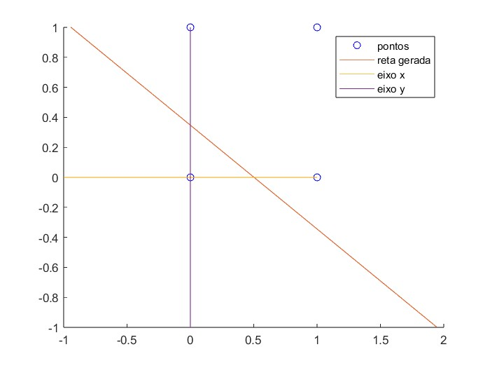

### Simulando porta OR com PERCEPETRON

#### O objetivo do script é inicializar um neurônio perceptron com pesos aleatórios, então treiná-lo e plotar, a partir de seus pesos treinados, a reta que separa as duas classes (VERDADEIRO E FALSO).

#### Ex:

